# Aplicación POS de Restaurante con React Native, Firebase y Superbase

## Información del Proyecto
- **Universidad:** Universidad de La Sabana  
- **Facultad:** Facultad de Ingeniería  
- **Materia:** Desarrollo Móvil  
- **Profesor:** Hans Camilo Correa Castro  

## Creado por
| Nombre | Correo Electrónico |
|--------|--------------------|
| Mariana Valle Moreno | marianavamo@unisabana.edu.co |
| Luisa Fernanda Carpintero Gabanzo | luisacarga@unisabana.edu.co |

## Estructura de la Documentación
- [1. Introducción](#1-introducción)
- [2. Tecnologías Utilizadas](#2-tecnologías-utilizadas)
- [3. Funcionalidades Clave](#3-funcionalidades-clave)
- [4. Flujo del Usuario](#4-flujo-del-usuario)
- [5. Conclusiones](#5-conclusiones)

---

## 1. Introducción

Esta aplicación móvil tipo POS (Point of Sale) fue desarrollada para la gestión completa de pedidos en un restaurante. Está diseñada con múltiples flujos para diferentes tipos de usuario: cliente, chef, cajero y administrador.

### Client

El cliente puede registrarse o iniciar sesión desde la aplicación. Una vez dentro, puede explorar el menú dividido por categorías como entradas, platos fuertes, postres y bebidas, seleccionar lo que desea ordenar, especificar si tiene alguna alergia, y elegir su mesa ya sea ingresándola manualmente o escaneando un código QR. Finalmente, puede confirmar y enviar su orden con facilidad.

### Chef

El chef también puede crear una cuenta o iniciar sesión desde la aplicación. Una vez dentro, recibe en tiempo real y de forma organizada las órdenes enviadas por los clientes. Para cada orden, puede ver el total, los platos solicitados y el tiempo transcurrido desde que fue realizada. Además, la tarjeta de la orden cambia a color rojo si la preparación se está demorando demasiado. Al ingresar a una orden específica, el chef puede ver el número de mesa desde la cual se hizo el pedido y tiene la capacidad de actualizar el estado de la orden: primero a “En proceso” y luego a “Entregado”.

### Cashier

El cajero también puede crear una cuenta o iniciar sesión desde la aplicación. Una vez dentro, puede visualizar las órdenes filtradas por estado: “Recibido”, “En proceso”, “Entregado” o “Pagado”. Sin embargo, solo las órdenes que se encuentran en estado “Entregado” pueden ser marcadas como pagadas. Cada orden muestra el detalle de los platos seleccionados, sus cantidades y el valor total con impuestos incluidos.

### Administrator

El administrador tiene acceso a una vista especializada donde puede agregar nuevos platos al menú, editar los existentes o eliminarlos. Para facilitar la gestión, puede buscar platos por su título. Además, al agregar un nuevo plato, tiene la opción de subir una imagen usando la cámara del dispositivo o seleccionándola desde la galería, gracias a la creación de un modal de cámara personalizado.

---

## 2. Tecnologías Utilizadas

| Tecnología             | Descripción                                       |
|-----------------------|-------------------------------------------------|
| **React Native**      | Framework para desarrollo móvil multiplataforma. |
| **Expo Router**       | Sistema de navegación basado en rutas para Expo. |
| **Firebase Authentication** | Servicio de autenticación de usuarios mediante correo y contraseña. |
| **Firebase Firestore** | Base de datos en la nube utilizada para almacenar el menú y las órdenes. |
| **Supabase Storage** | 	Servicio utilizado para almacenar las imágenes de los platos del menú. |
| **Expo Camera** | 		API utilizada para escanear códigos QR y capturar imágenes desde la cámara. |

---

## 3. Funcionalidades Clave
- **Autenticación multirol**:	Registro y acceso para clientes, chefs, cajeros y administradores.
- **Menú visual por categorías**: Visualización del menú dividido en entradas, platos fuertes, postres y bebidas, cada uno con imagen, nombre, descripción y precio para cada plato.
- **Carrito de compras dinámico**: Selección de platos con control de cantidades y cálculo automático del total.
- **Registro de alergias**: El cliente puede indicar alergias alimentarias antes de enviar su orden.
- **Selección de mesa**: El cliente puede elegir su mesa desde un ModalSelector o escanear un código QR.
- **Seguimiento de pedidos en tiempo real**:	El cliente ve en tiempo real el estado de su orden según lo actualice el chef.
- **Gestión de pagos**:	El cajero visualiza la orden entregada, calcula impuestos y procesa el pago.
- **Gestión del menú (CRUD)**: El administrador puede agregar, editar o eliminar platos, incluyendo imágenes capturadas desde cámara o galería.

---

## 4. Flujo del Usuario

### Client
1. Inicia sesión o se registra.
2. Navega el menú y agrega platos al carrito.
3. Confirma su selección.
4. Elige su mesa manualmente o escaneando un código QR, y registra alergias si aplica.
5. Envía su orden y realiza seguimiento en tiempo real.

 
   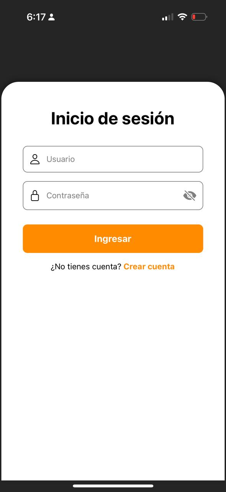 
   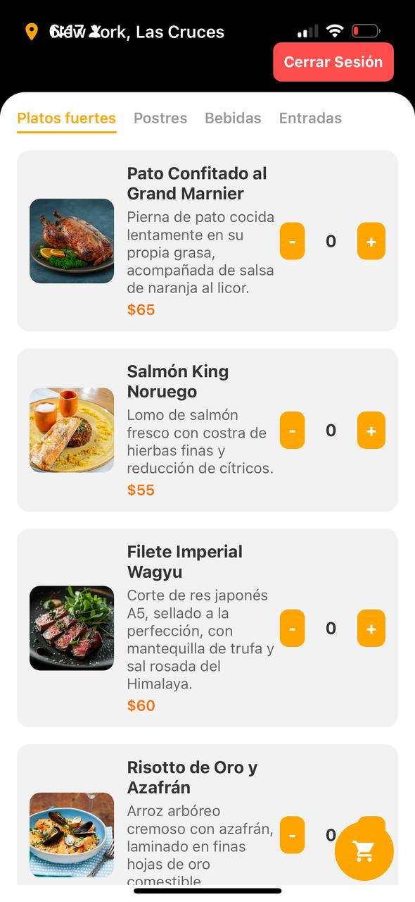 
   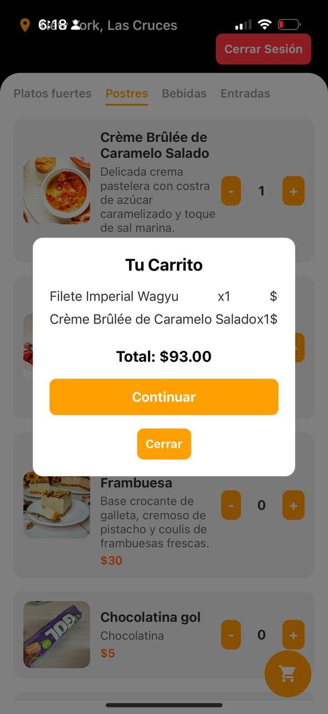 
   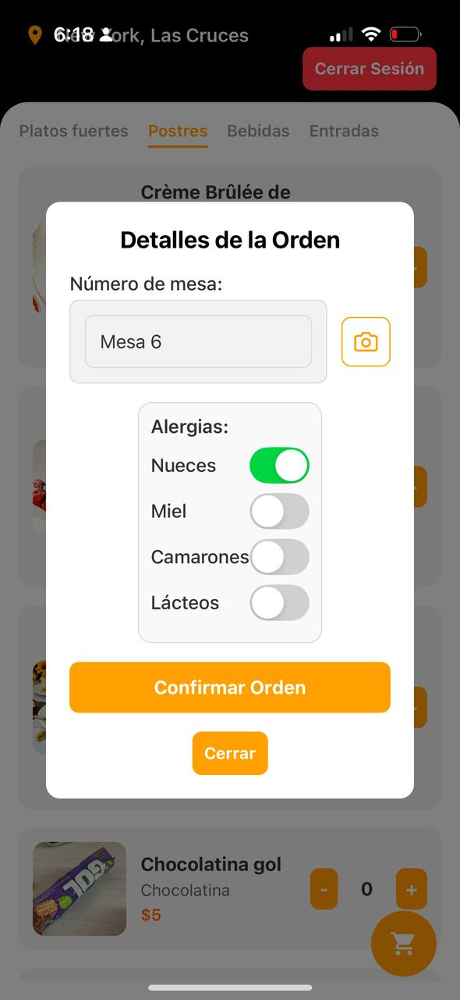 
   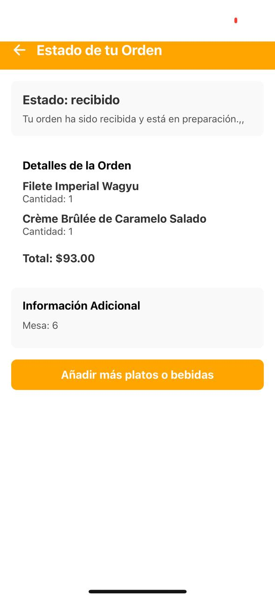 

### Chef
1. Visualiza las órdenes ordenadas cronológicamente (de la más antigua a la más reciente).
2. Cambia el estado de la orden a "En preparación" cuando inicia su elaboración.
3. Actualiza la orden a "Entregado" una vez finalizada.
4. La orden desaparece automáticamente del panel principal al ser entregada.

 
   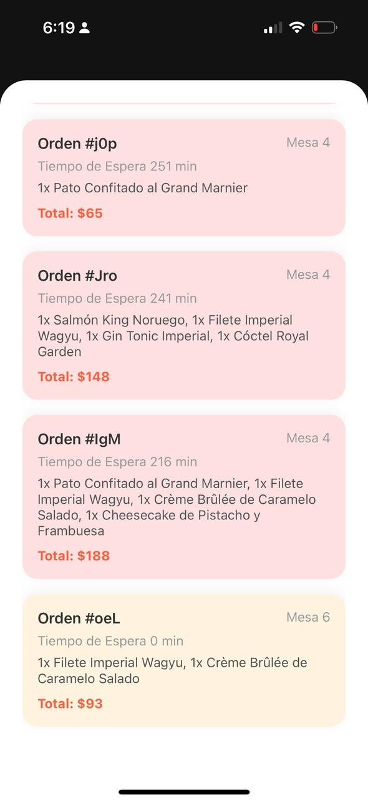 
   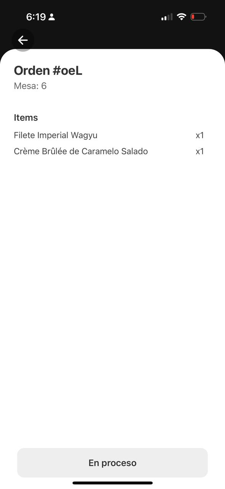 
   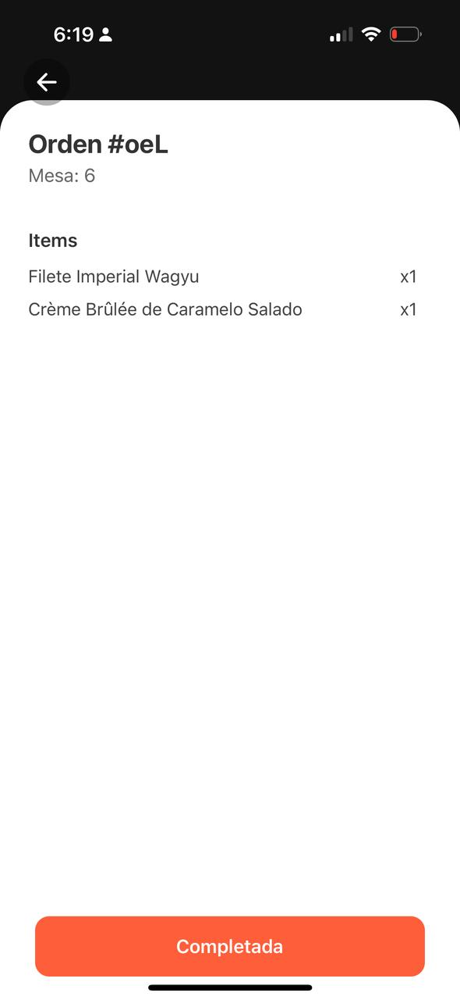 
   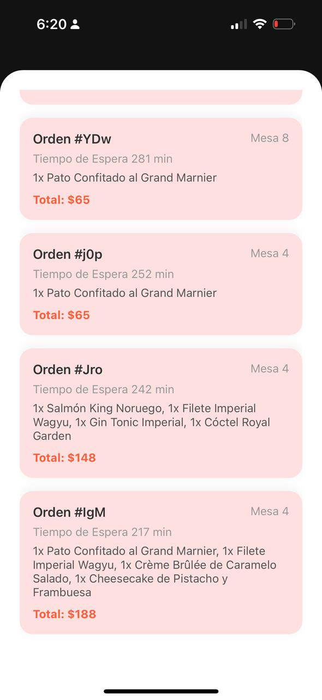

### Cashier
1. Visualiza las órdenes disponibles según su estado.
2. Accede al detalle de cada orden, incluyendo platos, cantidades, totales e impuestos, gestiona el pago y marca la orden como completada.
3. Confirma la transacción desde la lista de órdenes pagadas.

 
   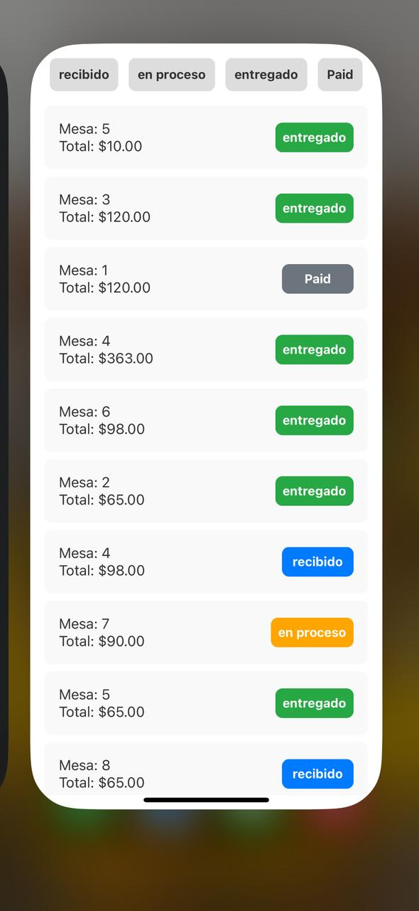 
   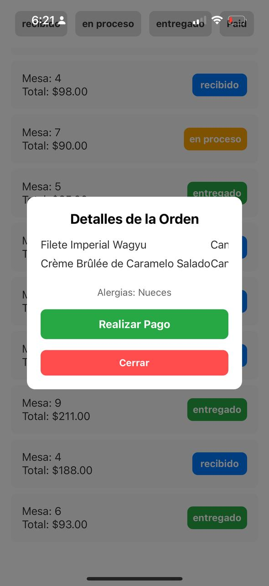 
   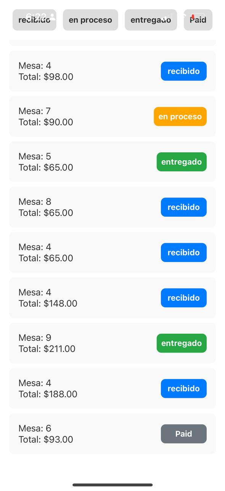

### Administrator
1. Puede agregar, editar o eliminar platos del menú.
2. Agrega nuevos platos con título, descripción, precio y categoría.
3. Utiliza la cámara o galería para subir imágenes al crear o editar un plato.
4. Visualiza un preview de la imagen seleccionada antes de confirmar.
5. Modifica la información de platos existentes.
6. Elimina platos del menú de forma definitiva.

 
    
   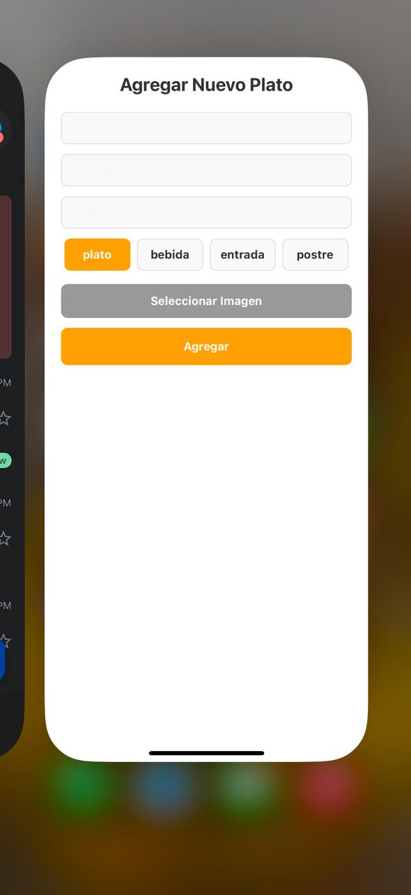 
   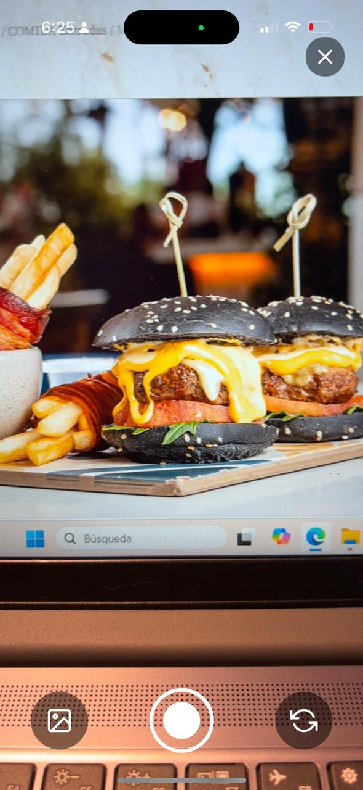 
   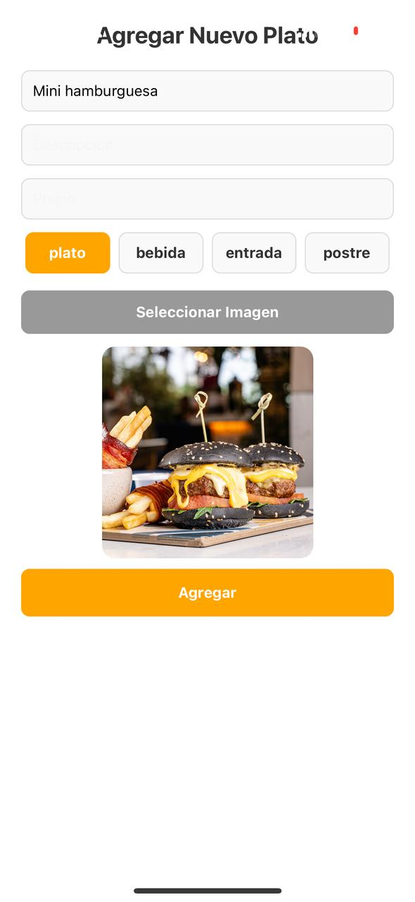
    
   

---

## 5. Conclusiones

La aplicación desarrollada representa una solución integral para la gestión eficiente de un restaurante, abarcando todos los roles clave: cliente, chef, cajero y administrador. Este enfoque permite centralizar operaciones, reducir errores humanos y mejorar significativamente la experiencia del usuario en cada etapa del servicio.

Entre los principales valores que aporta esta aplicación se destacan:

- **Optimización del flujo de trabajo**: Desde la toma del pedido hasta el pago, cada actor interactúa con una interfaz dedicada y adaptada a su función, lo que agiliza la operación interna del restaurante.
- **Mejora de la experiencia del cliente**: Gracias a la visualización clara del menú, la posibilidad de escanear un QR para seleccionar la mesa y el seguimiento en tiempo real de la orden, el cliente se siente informado y en control de su experiencia gastronómica.
- **Reducción de errores y mayor trazabilidad**: La digitalización de los pedidos evita confusiones, permite un registro exacto de lo solicitado y garantiza que la información llegue correctamente a cocina y caja.
- **Gestión ágil del menú**: El administrador puede mantener actualizado el menú en tiempo real, incluyendo imágenes y precios, con facilidad y sin depender de procesos externos.

En conjunto, esta aplicación no solo mejora la operatividad de un restaurante, sino que también representa una herramienta tecnológica adaptable y robusta, ideal para modernizar el servicio, optimizar procesos y brindar una experiencia más fluida y profesional tanto para el cliente como para el personal del establecimiento.

